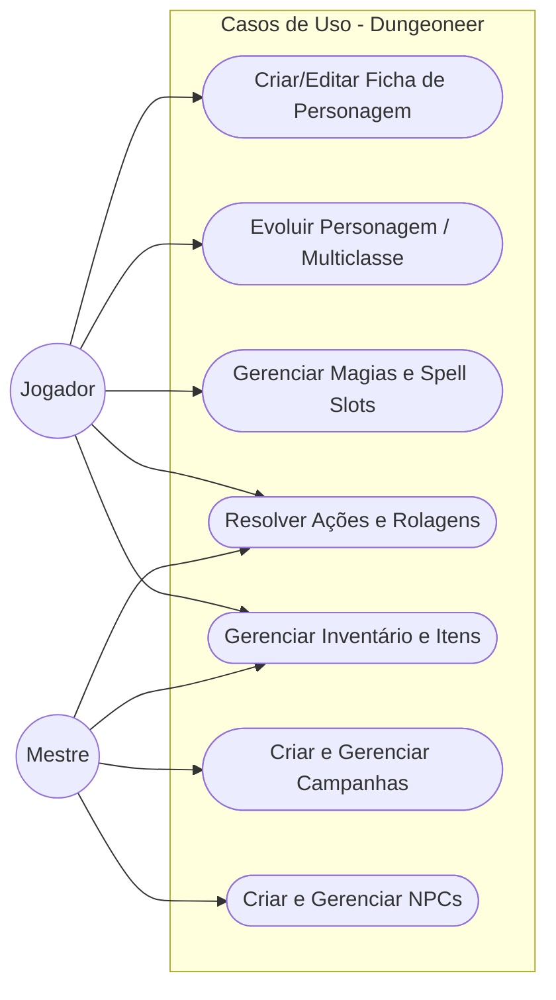

# CASOS DE USO

Temos dois atores principais no Dungeoneer: o Jogador (focado na sua ficha) e o Mestre (focado na campanha e no mundo).

## Principais Casos de Uso do Domínio:

1. **Criar Personagem**: Define os AbilityScores base, seleciona Lineage e Background (injetando os Feats correspondentes), e inicializa a primeira ClassProgression.

2. **Evoluir Personagem (Level Up / Multiclasse)**: Adiciona novos níveis a uma ClassProgression existente ou cria uma nova (multiclasse), escolhe uma Subclass e atualiza a capacidade mágica baseada na SpellcastingStrategy (FullCaster, PactMagic, etc.).

3. **Gerenciar Magias**: Consulta a lista availableSpells da classe/subclasse para aprender novas magias e controla o uso diário dos spell slots.

4. **Resolver Ações e Rolagens**: O sistema utiliza a interface genérica DiceRoll para instanciar e calcular resultados de CheckRoll (ataques e testes de resistência considerando vantagem/proficiência), DamageRoll e HealRoll baseados nos AbilityScores do ator.

5. **Gerenciar Inventário**: Adiciona itens à ficha do personagem e aplica automaticamente os Feats ou modificadores concedidos por equipamentos mágicos ou armas.

6. **Gerenciar Campanhas e NPCs (Mestre)**: Permite ao Mestre criar sessões, agrupar personagens e instanciar NPCs (reutilizando a lógica de AbilityScores e rolagens centralizadas).

## Diagrama
