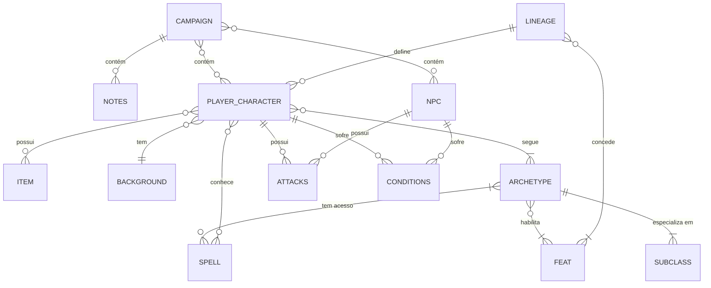
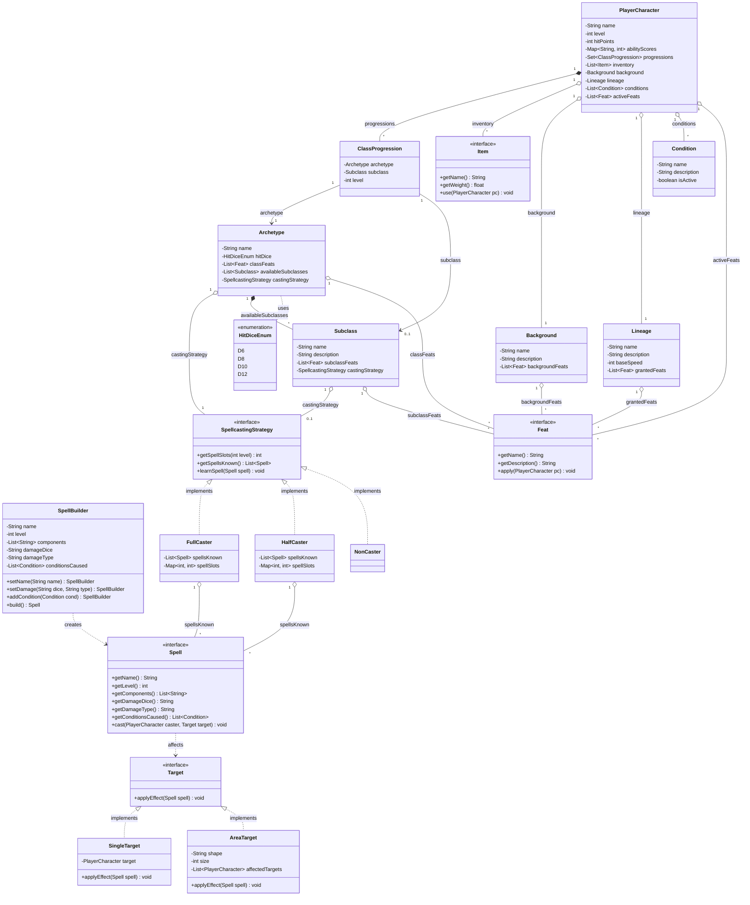

# Dungeoneer 🐉
#### DnD Campaign and Character Sheet Manager

O Dungeoneer é uma aplicação unificada para gerenciamento de campanhas, NPCs e fichas de personagens de Dungeons & Dragons. Este projeto foi concebido utilizando os princípios da Clean Architecture, priorizando um design de software que seja flexível, coeso e fácil de manter a longo prazo.

## 🛠️ Tecnologias Utilizadas
A stack tecnológica foi escolhida para garantir robustez no backend e uma interface moderna e tipada no frontend:
- **Backend**: Java com Spring Boot.
- **Frontend**: Next.js com TypeScript e componentes shadcn/ui.
- **Banco de Dados**: PostgreSQL.
- **Comunicação**: API REST (HTTP) para tráfego de dados isolados e padronizados entre o cliente e o servidor.
- **Infraestrutura**: Docker para conteinerização de todos os serviços, garantindo que o ambiente de desenvolvimento seja idêntico ao de produção.

## 🏛️ Decisões Arquiteturais

### 1. Monolito Modular Preparado para o Futuro  

Atualmente, o sistema foi desenhado como um Monolito. No entanto, devido à forte separação de conceitos da Clean Architecture, as fronteiras entre os módulos do sistema (como a gestão de usuários, fichas de personagens e rolagem de dados) são bem definidas. Uma boa arquitetura permite que um sistema nasça como um monolito, mas cresça até se tornar um conjunto de microsserviços independentes quando a necessidade de escalabilidade surgir

### 2. Design Orientado a Objetos e Padrões de Projeto  

O núcleo do sistema (as Entidades do D&D) foi modelado para proteger as regras de negócio:

1. **Composição sobre Herança**: Em vez de criar uma hierarquia rígida de classes para representar capacidades dos personagens (Feats), utilizamos o Padrão Strategy através de uma interface genérica Feat. Isso permite atribuir habilidades de raças, classes e antecedentes dinamicamente, mantendo o sistema extensível e alinhado aos princípios de design de software.

2. **Padrão Builder**: A entidade Spell (Magia) 
possui dezenas de atributos opcionais (como tipos de dano, condições, componentes verbais/somáticos). O padrão Builder foi adotado para simplificar a instanciação desses objetos complexos sem poluir a classe com construtores gigantes.

3. **Segregação de Interfaces (ISP)**: A lógica de uso de magias foi extraída para uma interface SpellcastingStrategy (FullCaster, HalfCaster, NonCaster). Isso garante que personagens puramente marciais não herdem código inútil de pontos de magia, mantendo as classes coesas.

4. **Inversão de Dependências (DIP)**: Para lidar com magias de área e alvo único de forma limpa, extraímos o conceito de alvo para uma interface Target (AreaTarget, SingleTarget), permitindo que a magia afete o jogo sem precisar saber como o alvo é calculado.

---
## 📊 Diagramas
### Diagrama Entidade-Relacionamento (Conceitual)

Visão de alto nível sobre como os dados se relacionam no banco de dados:

### Diagrama de Classes (Core Domain)

Estrutura das Entidades focada nas regras de negócio e na progressão da Ficha do Jogador (PlayerCharacter):

