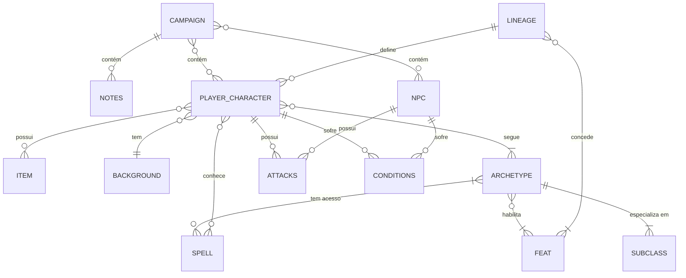

# Dungeoneer 🐉
#### DnD Campaign and Character Sheet Manager

O Dungeoneer é uma aplicação unificada para gerenciamento de campanhas, NPCs e fichas de personagens de Dungeons & Dragons. Este projeto foi concebido utilizando os princípios da Clean Architecture, priorizando um design de software que seja flexível, coeso e fácil de manter a longo prazo.

## 🛠️ Tecnologias Utilizadas

A stack tecnológica foi escolhida para garantir robustez no backend e uma interface moderna e tipada no frontend:
- **Backend**: Java com Spring Boot.
- **Frontend**: Next.js com TypeScript e componentes shadcn/ui.
- **Banco de Dados**: PostgreSQL.
- **Comunicação**: API REST (HTTP) para tráfego de dados isolados e padronizados entre o cliente e o servidor.
- **Infraestrutura**: Docker para conteinerização de todos os serviços, garantindo que o ambiente de desenvolvimento seja idêntico ao de produção.

## 🏛️ Decisões Arquiteturais

### 1. Monolito Modular Preparado para o Futuro  

Atualmente, o sistema foi desenhado como um Monolito. No entanto, devido à forte separação de conceitos da Clean Architecture, as fronteiras entre os módulos do sistema (como a gestão de usuários, fichas de personagens e rolagem de dados) são bem definidas. Uma boa arquitetura permite que um sistema nasça como um monolito, mas cresça até se tornar um conjunto de microsserviços independentes quando a necessidade de escalabilidade surgir

### 2. Design Orientado a Objetos e Padrões de Projeto  

O núcleo do sistema (as Entidades do D&D) foi modelado para proteger as regras de negócio:

1. **Composição sobre Herança**: Em vez de criar uma hierarquia rígida de classes para representar capacidades dos personagens (Feats), utilizamos o Padrão Strategy através de uma interface genérica Feat. Isso permite atribuir habilidades de raças, classes e antecedentes dinamicamente, mantendo o sistema extensível e evitando uma explosão combinatória de subclasses.

2. **Padrão Builder para Objetos Complexos**: A entidade Spell (Magia) possui dezenas de atributos opcionais (como múltiplos tipos de dano com dados diferentes, efeitos ao longo do tempo e componentes). O Padrão Builder foi adotado para simplificar e padronizar a instanciação desses objetos, permitindo associar múltiplos dados (instâncias da classe Dice) a tipos de dano na mesma magia sem poluir a classe com construtores gigantes.

3. **Princípio de Segregação de Interfaces (ISP)**: A mecânica de uso de magias foi extraída para a abstração SpellcastingStrategy (com implementações independentes como FullCaster, HalfCaster, PactMagic e NonCaster). Isso garante que personagens puramente marciais não dependam ou herdem código inútil de atributos mágicos, mantendo as classes enxutas e coesas.

4. **Princípio de Inversão de Dependências (DIP)**: Para lidar com magias de área e alvo único de forma limpa, extraímos o conceito de alvo para uma interface Target (AreaTarget, SingleTarget). A magia afeta a abstração do alvo, sem precisar conhecer detalhes de cálculos de área ou a implementação da grade do mapa.

5. **Princípio da Responsabilidade Única (SRP) e Objetos de Valor**: Em vez de tratar dados físicos do jogo como variáveis simples (String ou int), criamos a classe Dice. Como um Objeto de Valor (Value Object) na camada de domínio, ela isola todas as Regras Críticas de Negócio relacionadas a rolagens e acertos críticos, garantindo que o comportamento dos dados tenha um único motivo para mudar.

6. **Princípio DRY (Don't Repeat Yourself) via Abstração**: O conjunto de atributos do jogo não é tratado como um mapa solto, mas encapsulado na interface AbilityScores. Como Personagens (PCs), NPCs e até itens mecânicos exigem cálculos de modificadores constantes, compor AbilityScores dentro desses atores centraliza o cálculo matemático, evitando que lógicas vitais do sistema sejam reescritas.

7. **Extensão do Princípio Aberto/Fechado (OCP)**: Itens agora também possuem a capacidade de conceder Feats. Se uma arma ou equipamento mágico fornece proficiências, um ataque especial ou magias, ele apenas injeta o Feat no personagem. Assim, o sistema se mantém aberto para expansão (novos itens malucos criados pelos jogadores) e fechado para modificação (a classe PlayerCharacter não precisa ser alterada para acomodá-los).

---
## 📊 Diagramas
### Diagrama Entidade-Relacionamento (Conceitual)

Visão de alto nível sobre como os dados se relacionam no banco de dados:


### Diagrama de Classes (Core Domain)

Estrutura das Entidades focada nas regras de negócio e na progressão da Ficha do Jogador (PlayerCharacter):

```mermaid
classDiagram
    class PlayerCharacter {
        -String name
        -int level
        -int hitPoints
        -AbilityScores abilityScores
        -Set~ClassProgression~ progressions
        -List~Item~ inventory
        -Background background
        -Lineage lineage
        -List~Condition~ conditions
        -List~Feat~ activeFeats
    }

    class AbilityScores {
        <<interface>>
        +getScore(String ability) int
        +getModifier(String ability) int
    }

    class Dice {
        -int faces
        +roll(int quantity) int
        +rollCritical(int quantity) int
    }

    %% Nova Hierarquia de Rolagens
    class DiceRoll {
        <<interface>>
        +resolve(AbilityScores stats) int
    }

    class DamageRoll {
        -DamageType damageType
        -int numberOfDice
        -Dice dice
        -boolean addModifier
        -String keyAttribute
    }

    class HealRoll {
        -HealType type
        -int numberOfDice
        -Dice dice
        -boolean addModifier
        -String keyAttribute
    }

    class CheckRoll {
        -boolean advantage
        -boolean disadvantage
        -boolean addProficiency
        -String keyAttribute
    }

    class DamageType {
        <<enumeration>>
        FIRE
        COLD
        LIGHTNING
        THUNDER
        FORCE
        PSYCHIC
        RADIANT
        NECROTIC
        SLASHING
        BLUDGEONING
        PIERCING
    }

    class HealType {
        <<enumeration>>
        HP
        THP
    }

    DiceRoll <|.. DamageRoll
    DiceRoll <|.. HealRoll
    DiceRoll <|.. CheckRoll
    DamageRoll --> DamageType
    HealRoll --> HealType
    DamageRoll --> Dice
    HealRoll --> Dice

    class ClassProgression {
        -Archetype archetype
        -Subclass subclass
        -int level
    }

    class Archetype {
        -String name
        -HitDiceEnum hitDice
        -List~Feat~ classFeats
        -List~Subclass~ availableSubclasses
        -List~Spell~ availableSpells
        -SpellcastingStrategy castingStrategy
    }

    class Subclass {
        -String name
        -String description
        -List~Feat~ subclassFeats
        -List~Spell~ availableSpells
        -SpellcastingStrategy castingStrategy
    }

    class HitDiceEnum {
        <<enumeration>>
        D6
        D8
        D10
        D12
    }

    class Feat {
        <<interface>>
        +getName() String
        +getDescription() String
        +apply(PlayerCharacter pc) void
    }

    class Item {
        <<interface>>
        +getName() String
        +getWeight() float
        +getGrantedFeats() List~Feat~
        +use(PlayerCharacter pc) void
    }

    class Spell {
        <<interface>>
        +getName() String
        +getLevel() int
        +getComponents() List~String~
        +getEffects() List~DiceRoll~
        +getConditionsCaused() List~Condition~
        +cast(PlayerCharacter caster, Target target) void
    }

    class Target {
        <<interface>>
        +applyEffect(Spell spell) void
    }

    class SingleTarget
    class AreaTarget

    class SpellBuilder {
        -String name
        -int level
        -List~String~ components
        -List~DiceRoll~ effects
        -List~Condition~ conditionsCaused
        +setName(String name) SpellBuilder
        +addEffect(DiceRoll roll) SpellBuilder
        +build() Spell
    }

    class SpellcastingStrategy {
        <<interface>>
        +getSpellSlots(int level) int
        +getSpellsKnown() List~Spell~
        +learnSpell(Spell spell) void
    }

    class FullCaster
    class HalfCaster
    class ThirdCaster
    class PactMagic
    class NonCaster

    class Lineage {
        -String name
        -List~Feat~ grantedFeats
    }

    class Background {
        -String name
        -List~Feat~ backgroundFeats
    }

    class Condition {
        -boolean isActive
    }

    %% Relacionamentos do Strategy de Magia e Alvos
    SpellcastingStrategy <|.. FullCaster
    SpellcastingStrategy <|.. HalfCaster
    SpellcastingStrategy <|.. ThirdCaster
    SpellcastingStrategy <|.. PactMagic
    SpellcastingStrategy <|.. NonCaster
    
    Archetype "1" o-- "1" SpellcastingStrategy : uses
    Subclass "1" o-- "0..1" SpellcastingStrategy : uses

    FullCaster "1" o-- "*" Spell : spellsKnown
    HalfCaster "1" o-- "*" Spell : spellsKnown
    ThirdCaster "1" o-- "*" Spell : spellsKnown
    PactMagic "1" o-- "*" Spell : spellsKnown

    Archetype "1" o-- "*" Spell : availableSpells
    Subclass "1" o-- "*" Spell : availableSpells
    
    Target <|.. SingleTarget
    Target <|.. AreaTarget
    SpellBuilder ..> Spell : creates
    Spell ..> Target : affects
    Spell "1" *-- "*" DiceRoll : has

    %% Relações Principais do Personagem
    PlayerCharacter "1" *-- "*" ClassProgression : progressions
    PlayerCharacter "1" o-- "1" AbilityScores : stats
    ClassProgression "1" --> "1" Archetype : archetype
    ClassProgression "1" --> "0..1" Subclass : subclass
    Archetype "1" *-- "*" Subclass : availableSubclasses
    Archetype ..> HitDiceEnum : uses

    PlayerCharacter "1" o-- "*" Item : inventory
    PlayerCharacter "1" o-- "1" Background : background
    PlayerCharacter "1" o-- "1" Lineage : lineage
    PlayerCharacter "1" o-- "*" Condition : conditions
    PlayerCharacter "1" o-- "*" Feat : activeFeats

    %% Fornecimento de Feats
    Item "1" o-- "*" Feat : grantedFeats
    Lineage "1" o-- "*" Feat : grantedFeats
    Background "1" o-- "*" Feat : backgroundFeats
    Archetype "1" o-- "*" Feat : classFeats
    Subclass "1" o-- "*" Feat : subclassFeats```