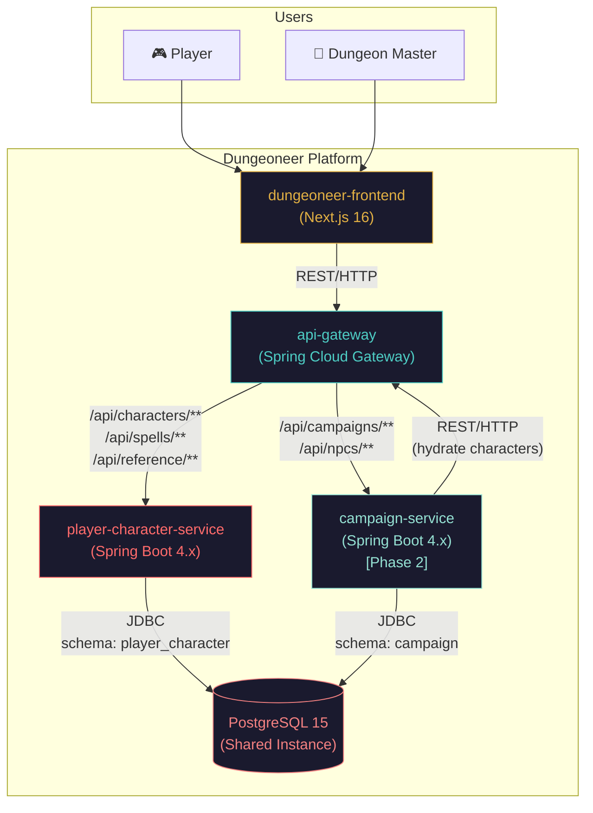
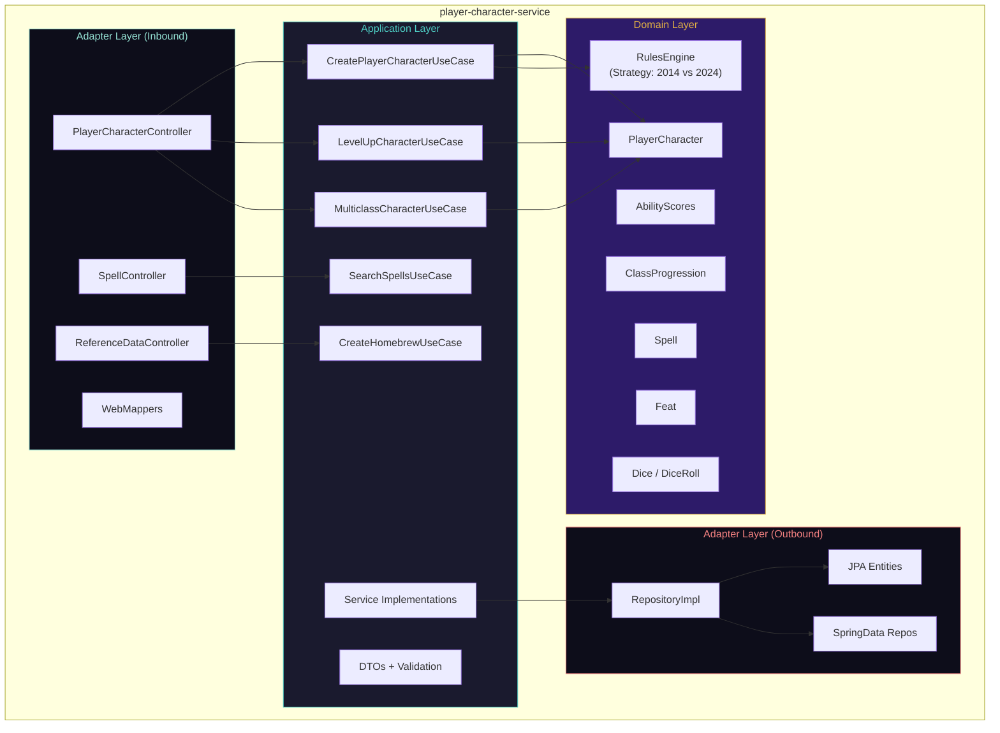
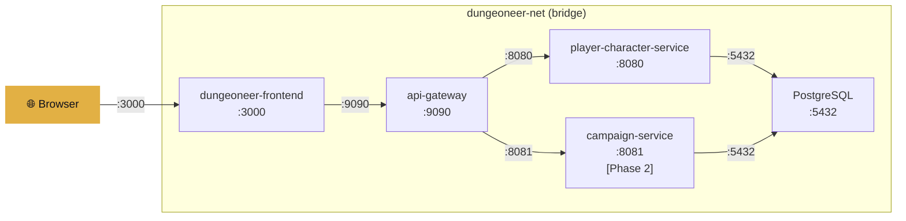

# Architecture Diagram

## System Context (C4 Level 1)

```mermaid
graph TB
    subgraph Users
        Player["🎮 Player"]
        DM["🎲 Dungeon Master"]
    end

    subgraph Dungeoneer["Dungeoneer Platform"]
        FE["dungeoneer-frontend<br/>(Next.js 16)"]
        GW["api-gateway<br/>(Spring Cloud Gateway)"]
        PCS["player-character-service<br/>(Spring Boot 4.x)"]
        CS["campaign-service<br/>(Spring Boot 4.x)<br/>[Phase 2]"]
        DB[("PostgreSQL 15<br/>(Shared Instance)")]
    end

    Player --> FE
    DM --> FE
    FE -->|"REST/HTTP"| GW
    GW -->|"/api/characters/**<br/>/api/spells/**<br/>/api/reference/**"| PCS
    GW -->|"/api/campaigns/**<br/>/api/npcs/**"| CS
    PCS -->|"JDBC<br/>schema: player_character"| DB
    CS -->|"JDBC<br/>schema: campaign"| DB
    CS -->|"REST/HTTP<br/>(hydrate characters)"| GW

    style FE fill:#1a1a2e,stroke:#e2b044,color:#e2b044
    style GW fill:#1a1a2e,stroke:#4ecdc4,color:#4ecdc4
    style PCS fill:#1a1a2e,stroke:#ff6b6b,color:#ff6b6b
    style CS fill:#1a1a2e,stroke:#95e1d3,color:#95e1d3
    style DB fill:#1a1a2e,stroke:#f38181,color:#f38181
```

## Container Diagram (C4 Level 2) — player-character-service

```mermaid
graph TB
    subgraph PCS["player-character-service"]
        subgraph Adapters_In["Adapter Layer (Inbound)"]
            CTRL["PlayerCharacterController"]
            SPELL_CTRL["SpellController"]
            REF_CTRL["ReferenceDataController"]
            MAPPER["WebMappers"]
        end

        subgraph Application["Application Layer"]
            UC_CREATE["CreatePlayerCharacterUseCase"]
            UC_LEVELUP["LevelUpCharacterUseCase"]
            UC_MULTICLASS["MulticlassCharacterUseCase"]
            UC_SPELL_SEARCH["SearchSpellsUseCase"]
            UC_HOMEBREW["CreateHomebrewUseCase"]
            SERVICES["Service Implementations"]
            DTOs["DTOs + Validation"]
        end

        subgraph Domain["Domain Layer"]
            PC["PlayerCharacter"]
            AS["AbilityScores"]
            CP["ClassProgression"]
            SPELL["Spell"]
            FEAT["Feat"]
            DICE["Dice / DiceRoll"]
            RULES["RulesEngine<br/>(Strategy: 2014 vs 2024)"]
        end

        subgraph Adapters_Out["Adapter Layer (Outbound)"]
            REPO["RepositoryImpl"]
            JPA["JPA Entities"]
            SPRING_DATA["SpringData Repos"]
        end
    end

    CTRL --> UC_CREATE
    CTRL --> UC_LEVELUP
    CTRL --> UC_MULTICLASS
    SPELL_CTRL --> UC_SPELL_SEARCH
    REF_CTRL --> UC_HOMEBREW

    UC_CREATE --> PC
    UC_CREATE --> RULES
    UC_LEVELUP --> PC
    UC_MULTICLASS --> PC

    SERVICES --> REPO
    REPO --> JPA
    REPO --> SPRING_DATA

    style Domain fill:#2d1b69,stroke:#e2b044,color:#e2b044
    style Application fill:#1a1a2e,stroke:#4ecdc4,color:#4ecdc4
    style Adapters_In fill:#0d0d1a,stroke:#95e1d3,color:#95e1d3
    style Adapters_Out fill:#0d0d1a,stroke:#f38181,color:#f38181
```

## Docker Compose Network Topology

```mermaid
graph LR
    subgraph dungeoneer-net["dungeoneer-net (bridge)"]
        FE["dungeoneer-frontend<br/>:3000"]
        GW["api-gateway<br/>:9090"]
        PCS["player-character-service<br/>:8080"]
        CS["campaign-service<br/>:8081<br/>[Phase 2]"]
        DB["PostgreSQL<br/>:5432"]
    end

    Browser["🌐 Browser"] -->|":3000"| FE
    FE -->|":9090"| GW
    GW -->|":8080"| PCS
    GW -->|":8081"| CS
    PCS -->|":5432"| DB
    CS -->|":5432"| DB

    style Browser fill:#e2b044,stroke:#e2b044,color:#0f0f1a
```
