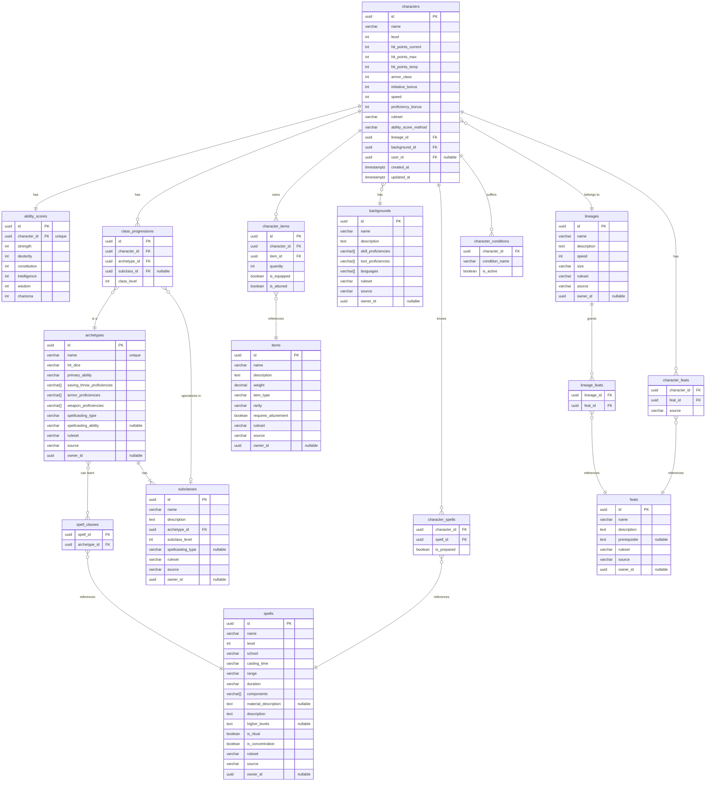
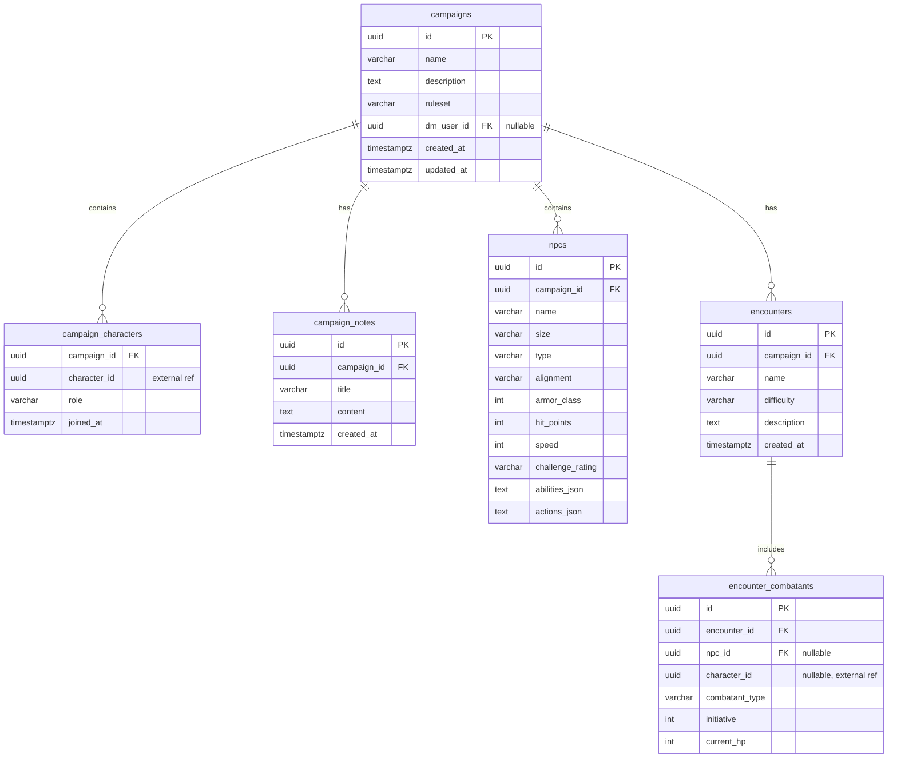

# Entity-Relationship Diagram

## player_character Schema

```mermaid
erDiagram
    characters ||--|| ability_scores : "has"
    characters ||--o{ class_progressions : "has"
    characters }o--|| lineages : "belongs to"
    characters }o--|| backgrounds : "has"
    characters ||--o{ character_spells : "knows"
    characters ||--o{ character_items : "owns"
    characters ||--o{ character_feats : "has"
    characters ||--o{ character_conditions : "suffers"

    class_progressions }o--|| archetypes : "is a"
    class_progressions }o--o| subclasses : "specializes in"

    archetypes ||--|{ subclasses : "has"
    archetypes }o--o{ spell_classes : "can learn"

    character_spells }o--|| spells : "references"
    spell_classes }o--|| spells : "references"

    character_items }o--|| items : "references"
    character_feats }o--|| feats : "references"

    lineages ||--o{ lineage_feats : "grants"
    lineage_feats }o--|| feats : "references"

    characters {
        uuid id PK
        varchar name
        int level
        int hit_points_current
        int hit_points_max
        int hit_points_temp
        int armor_class
        int initiative_bonus
        int speed
        int proficiency_bonus
        varchar ruleset
        varchar ability_score_method
        uuid lineage_id FK
        uuid background_id FK
        uuid user_id FK "nullable"
        timestamptz created_at
        timestamptz updated_at
    }

    ability_scores {
        uuid id PK
        uuid character_id FK "unique"
        int strength
        int dexterity
        int constitution
        int intelligence
        int wisdom
        int charisma
    }

    class_progressions {
        uuid id PK
        uuid character_id FK
        uuid archetype_id FK
        uuid subclass_id FK "nullable"
        int class_level
    }

    archetypes {
        uuid id PK
        varchar name "unique"
        varchar hit_dice
        varchar primary_ability
        varchar[] saving_throw_proficiencies
        varchar[] armor_proficiencies
        varchar[] weapon_proficiencies
        varchar spellcasting_type
        varchar spellcasting_ability "nullable"
        varchar ruleset
        varchar source
        uuid owner_id "nullable"
    }

    subclasses {
        uuid id PK
        varchar name
        text description
        uuid archetype_id FK
        int subclass_level
        varchar spellcasting_type "nullable"
        varchar ruleset
        varchar source
        uuid owner_id "nullable"
    }

    spells {
        uuid id PK
        varchar name
        int level
        varchar school
        varchar casting_time
        varchar range
        varchar duration
        varchar[] components
        text material_description "nullable"
        text description
        text higher_levels "nullable"
        boolean is_ritual
        boolean is_concentration
        varchar ruleset
        varchar source
        uuid owner_id "nullable"
    }

    spell_classes {
        uuid spell_id FK
        uuid archetype_id FK
    }

    feats {
        uuid id PK
        varchar name
        text description
        text prerequisite "nullable"
        varchar ruleset
        varchar source
        uuid owner_id "nullable"
    }

    lineages {
        uuid id PK
        varchar name
        text description
        int speed
        varchar size
        varchar ruleset
        varchar source
        uuid owner_id "nullable"
    }

    lineage_feats {
        uuid lineage_id FK
        uuid feat_id FK
    }

    backgrounds {
        uuid id PK
        varchar name
        text description
        varchar[] skill_proficiencies
        varchar[] tool_proficiencies
        varchar[] languages
        varchar ruleset
        varchar source
        uuid owner_id "nullable"
    }

    items {
        uuid id PK
        varchar name
        text description
        decimal weight
        varchar item_type
        varchar rarity
        boolean requires_attunement
        varchar ruleset
        varchar source
        uuid owner_id "nullable"
    }

    character_spells {
        uuid character_id FK
        uuid spell_id FK
        boolean is_prepared
    }

    character_items {
        uuid id PK
        uuid character_id FK
        uuid item_id FK
        int quantity
        boolean is_equipped
        boolean is_attuned
    }

    character_feats {
        uuid character_id FK
        uuid feat_id FK
        varchar source
    }

    character_conditions {
        uuid character_id FK
        varchar condition_name
        boolean is_active
    }
```

## campaign Schema (Phase 2)

```mermaid
erDiagram
    campaigns ||--o{ campaign_characters : "contains"
    campaigns ||--o{ campaign_notes : "has"
    campaigns ||--o{ npcs : "contains"
    campaigns ||--o{ encounters : "has"
    encounters ||--o{ encounter_combatants : "includes"

    campaigns {
        uuid id PK
        varchar name
        text description
        varchar ruleset
        uuid dm_user_id FK "nullable"
        timestamptz created_at
        timestamptz updated_at
    }

    campaign_characters {
        uuid campaign_id FK
        uuid character_id "external ref"
        varchar role
        timestamptz joined_at
    }

    campaign_notes {
        uuid id PK
        uuid campaign_id FK
        varchar title
        text content
        timestamptz created_at
    }

    npcs {
        uuid id PK
        uuid campaign_id FK
        varchar name
        varchar size
        varchar type
        varchar alignment
        int armor_class
        int hit_points
        int speed
        varchar challenge_rating
        text abilities_json
        text actions_json
    }

    encounters {
        uuid id PK
        uuid campaign_id FK
        varchar name
        varchar difficulty
        text description
        timestamptz created_at
    }

    encounter_combatants {
        uuid id PK
        uuid encounter_id FK
        uuid npc_id FK "nullable"
        uuid character_id "nullable, external ref"
        varchar combatant_type
        int initiative
        int current_hp
    }
```
